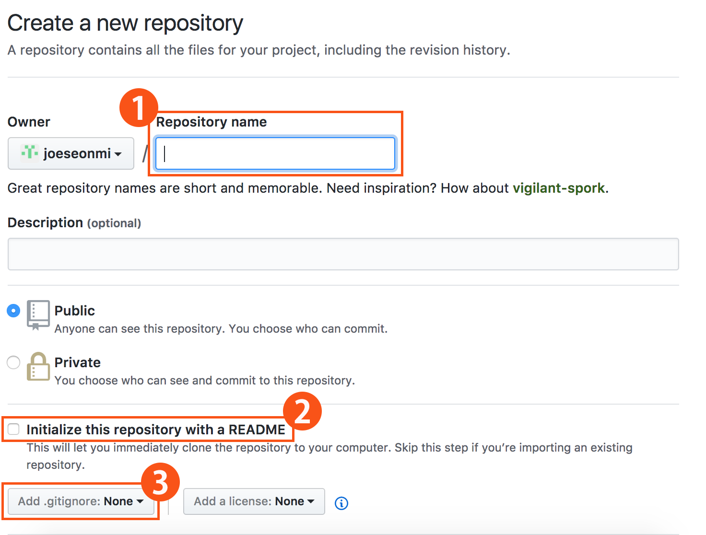
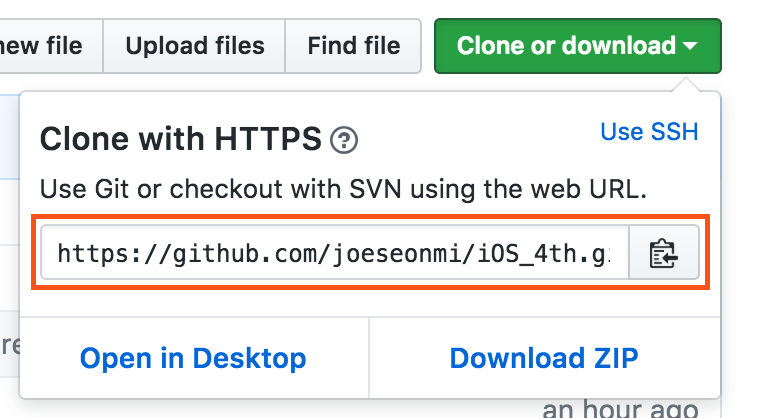

# 😂 Git이란?
> 분산 버전 관리 시스템

연결된 repository가 2개로 네트워크가 연결된 remote와 네트워크가 연결안된 local이 있다.
local은 나혼자 관리하고 remote는 여러사람이 볼수있지만 ~허용된사람 외에는~내려받는것만 허용 된다.

# Git remote와 local 연결
> 내부저장소(local) 외부저장소(remote)연결의 큰흐름

1. github에서 새로운 remote생성 - ( .gitignore, readme.md 빼먹지말고 )

	

	- 외부저장소이름정하기
	- 체크하면 readme.md 파일을 생성해준다
	- gitignore를 생성해주는데 1개밖에 선택 안되므로 어차피 [gitignore.io](https://www.gitignore.io) 에서 만들고 긁어와서 수정해 주어야 한다.

2. git을 만들어 관리할 폴더(work space) 생성 후 터미널을 연다

3. 관리폴더에 `git init` : **이게 내부저장소를 만든것**

4. github에서 remote링크가져다가 local에 연결해주기
	`git remote add origin <저장소주소>`
	
	

5. work space에는 아직 아무파일이없으니까 remote에서 readme, gitignore를 받아준다 `git pull origin master` - 받은다음 gitignore수정하던가, 수정하고 받던가해야됨

6. 이제 원하는 새로 생기는 파일들을 올려줄수있다.
	
	새 파일/혹은수정 
	
	👉🏻 `git add .`: 전체폴더를 stage로 보냄
	
	👉🏻 `git commit -m "XX"` : 스테이지에 올린파일을 local로 보냄 
	
	👉🏻 `git push origin master` : 로컬에있는 파일을 리모트로 보냄

