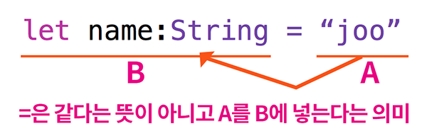

# 변수와 함수

- 변수 : 프로그램에서 데이터의 저장공간**[메모리]**을 담당
- 함수 : 프로그램이 실행되는 행동**[CPU]**을 담당


## 💎 변수


메모리만 봐서는 어디에 어떤데이터(name, type)가 있는지 알수없다.

👉🏻 그래서 알아보려고 타입과 이름을 지정해주는데 이걸 **선언한다** 하고
	var, let으로 선언한다.
	
	

- 변수를만드는데 필요한것


```변수는 메모리에서 데이터를 알아보기위해 만드는거```


### ⛱ 변수의 Swift문법


- **변수**는 변할 수 있는 값
- **상수**는 변할 수 없는 **고정값**




### ⛱ 변수명
> 변수 이름
> 
> - 명명규칙따라 작성
> - 유니코드포함 모든문자가능
> - 변수안의 데이터를 표현해야함
> - 중복X

> 명명규칙
> 
> - 시스템예약어불가
> - 공백안됨
> - **변수와 함수명**은 **소문자로시작** 띄어쓰기해야할 곳 마다 대문자
> - **클래스명**은 **대문자로시작** 띄어쓰기 해야할 곳 마다 대문자

### ⛱ 변수타입

- 정수(인트), 실수(더블), 문자열(스트링), 불리언(불)

> 스트링 조합
> 
> 1.병합(`+`기호사용)
> 
> ```swift
> var name:string = "joe"
> print("my name is" + name)
> ```
>
> 2.삽입(`\(참조값)`)
>
> ```swift
> var name:string = "joe"
> print("my name is \(name)")
> ```
>
> 튜플
> 
> - 사용자 정의 타입, 변수에 여러개의 값을 넣을때 쓴다
> - 소괄호안에 타입을 묶음으로 때려넣음
> - 타입마다 이름지정가능
>
> ```swift
> var coin:(Int,Int) = (3,3)
> print("10원짜리 : \(coin.0)")
> print("50원짜리 : \(coin.1)")
> 타입 이름이 없을땐 [변수명.0]부터 시작
> var person:(name:String, age:Int, weight:Double) = ("joo", 30, 180.2)
> print("이름 : \(person.name)")
> print("몸무게 : \(person.age)")
> print("몸무게 : \(person.weight)")
> 타입 이름이 있을땐 [변수명.타입이름]
> ```


> 캐스팅 (타입변환)
> 

total이 정수고, average는 실수로 정의되있기때문에
마지막줄에 total을 실수(Double)로 캐스팅해준다. 그럼 타입에러안남!


> 변수값 지정
> 
> 타입안써도 타입추론으로 대충 사용가능.


## 💎 함수

- 문법


> 인수명이 없을땐 매개변수명이 인수명으로 사용된다~
> 여기까지가 함수를 만든거고 실행은따로 해줘야한다.