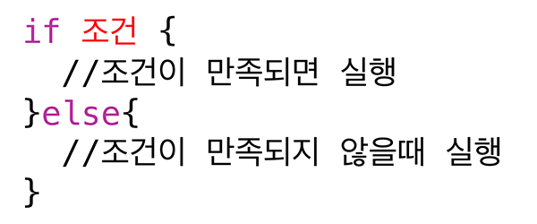
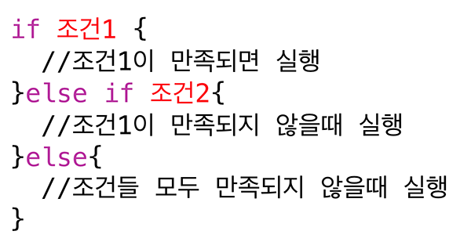

# 😱 조건문
- 함수 내부에서 실행되는 **선택문**
- 특정조건에 따라 **선택적**으로 코드를 실행
- 대표적인 조건문: if-else문과 switch-case

## if-else문

- 조건이 참일경우 if문 대괄호 안의 코드가 실행된다
- 조건이 거짓인 경우 else문 대광호 안의 코드가 실행된다

- 조건값은 Bool값으로 표현

## else if문

- 조건2는 조건1이 거짓일때 실행된다

### 조건만들기
- 비교연산자를 통해 조건의 결과가 bool값으로 나와야한다
- 논리연산자로 다양한 조건의 조합이 가능하다

